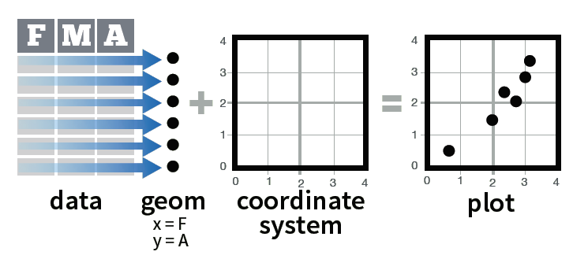

```{r xaringan-themer, include = FALSE}
library(xaringanthemer)

mono_light(
  base_color = "#1c5253",
  header_font_google = google_font("Josefin Sans"),
  text_font_google   = google_font("Montserrat", "300", "300i"),
  code_font_google   = google_font("Droid Mono"),
  text_font_size = "1.75em",
  header_h1_font_size="1.5em"
  
)

library(ggthemr)
ggthemr_reset()

```

# Loading the Package

In order to access any of the functions, we need to first load the library into the R session.  You'll always need to do this first whenever using `ggplot`. 

```{r}
library(ggplot2)
```

--

For these practice problems, we're going to make use of a dataset that is built into ggplot called `mpg`.

Use the help feature of RStudio to read about what this data set represents. 

--

```{r eval=FALSE} 
?mpg 
```

---

You can also use RStudio's View() function to get an idea of what is actually in this dataset. 

---
# ggplot2 Basics

**ggplot2** is based on the **grammar of graphics**, the idea that you can build every graph from the same few components:
- a data set
- a set of geoms (visual marks that represent data points)
- a coordinate system



---

To display the data values, we map variables in the data set to aesthetic properties of the geom like **size**, **color**, and **x**/**y** locations. 

---
# Our first plot

Run the following command in your R Console. 

```{r eval=FALSE}
ggplot(mpg, aes(x=displ,y=hwy)) +
  geom_point()
```

--

```{r fig.width=8,fig.height=5,echo=FALSE}
ggplot(mpg, aes(x=displ, y=hwy)) +
  geom_point()
```

---
# Structure of a call to ggplot

```{r eval=FALSE}
ggplot(                     )

```

Note that we first called ggplot. 
---
# Structure of a call to ggplot

```{r eval=FALSE}
ggplot(mpg,                 )

``` 

Note that we first called ggplot.

The first argument is the name of the dataset.

---
# Structure of a call to ggplot

```{r eval=FALSE}
ggplot(mpg,aes(x=displ,y=hwy))

```

Note that we first called ggplot.

The first argument is the name of the dataset.

The second argument is a call to aes()

---
# Aesthetics

Aesthetics are mappings of visual attributes of the graph to variables.  There are many different aesthetics, but the ones we will most commonly use are: 
- x, y
- color
- fill
- linetype
- size

---
# Structure of a call to ggplot

```{r eval=FALSE}
ggplot(mpg,aes(x=displ,y=hwy)) +
  geom_point()
```


We then add a layer to the graph.  Layers are specific types of geoms.

--

Other geoms include: 
- geom_density()
- geom_dotplot()
- geom_histogram()
- geom_bar()
- geom_boxplot()
- etc.

---
class: inverse, center, middle
# You try!

### See if you can construct a scatterplot between the city miles per gallon and the highway miles per gallon in the mpg dataset.

---
class: inverse, center, middle
# Try another!

### R has a built-in dataset by the name of `faithful`.  View the help file description of the dataset, and use the View() function to inspect it. 

### Construct a scatterplot of eruptions vs waiting.

---
# Aesthetic - Color

We can map a 3rd dimension onto our scatterplot through use of the **color** attribute.

```{r fig.width=8,fig.height=5, eval=FALSE}
ggplot(mpg,aes(x=displ,y=hwy,color=class)) +
  geom_point()
```

--

```{r fig.width=8,fig.height=4.5,echo=FALSE}
ggplot(mpg,aes(x=displ,y=hwy,color=class)) +
  geom_point()
```

---
# Aesthetic - Coloring Points

If you want to take the regular points and color them differently, then you can set the color inside of the geom_point() layer. 

```{r fig.width=8, fig.height=5, eval=FALSE}
ggplot(mpg, aes(x=displ,y=hwy))+
  geom_point(color="darkblue")
```

--

```{r fig.width=7, fig.height=4.25, echo=FALSE}
ggplot(mpg, aes(x=displ,y=hwy))+
  geom_point(color="darkblue")
```


---
# Aesthetic fun

You probably want to know what kind of colors are even available don't you?

See [this link](http://www.stat.columbia.edu/~tzheng/files/Rcolor.pdf)!

You can also make custom colors by utililizing the rgb function. 
Like this:  `rgb(1,1,0)`

---
# Aesthetic - Size

Just like with **color**, changing the **size** attribute within the `aes()` function will map **size** to a variable in the dataset. If you just want all of the points to be bigger or smaller, then you set the size to be a constant within the geom_point() layer. 

```{r fig.width=4,fig.height=3}
ggplot(mpg, aes(x=displ,y=hwy))+
  geom_point(size=4)
```

---
# Aesthetic - Size

There's a variable in the dataset that's called `cyl` that represents how many cylinders the car engine has.   See if you can construct a graph that has different sized points based on this variable.   It should look like this one:

```{r echo=FALSE, fig.width=8, fig.height=4.5}
ggplot(mpg,aes(x=displ,y=hwy,size=cyl))+
  geom_point()
```


---
# Aesthetic - Themes

If you're not a fan of the gray background with white lines, then you can easily change this.  `ggplot` has some built in graph themes that you may like better. Here's one: 

```{r fig.width=6,fig.height=4}
ggplot(mpg,aes(x=displ,y=hwy,color=class)) +
  geom_point() + 
  theme_bw() 
```

---
# Aesthetic - Themes

Other themes include: 
- theme_bw()
- theme_linedraw()
- theme_light()
- theme_dark()
- theme_minimal()
- theme_classic()
- or, you can download other R packages that contain additional themes and/or customize individual components of the theme yourself.

---
# ggthemr dust theme

```{r fig.width=7,fig.height=4,warning=FALSE}
library(ggthemr)
ggthemr('dust')  
ggplot(mpg,aes(x=displ,y=hwy,color=class)) +
  geom_point()

```

Also, try out flat, fresh, grape, light, lilac, pale, and solarized.

---
# Curve fitting

At times, we want to show the general shape of the dataset.  The `geom_smooth()` layer will let you do that.   Add this layer to the old faithful scatterplot you made earlier. 

--

```{r echo=FALSE}
ggthemr_reset()


```

```{r message=F, fig.width=8,fig.height=5,echo=FALSE}
ggplot(faithful,aes(x=eruptions,y=waiting))+
  geom_point()+
  geom_smooth()
```

---
# Line fitting

The `geom_smooth()` layer can also fit a line (a linear model) to the data.  Just use `method = lm`  in the call. 

` ... +
  geom_smooth(method = lm)
`

---
# Proper Labelling

We can add proper labels to our graphs by adding label layers.


---
class:center,middle

```{r message=F, fig.width=8,fig.height=5,echo=FALSE}
ggplot(faithful,aes(x=eruptions,y=waiting))+
  geom_point()+
  geom_smooth()+ggtitle("Time between eruptions vs length of eruption") +
  xlab("eruption time (seconds)") +
  ylab("time between eruptions (minutes)")
```


---


# Try your hand at it!

This graph is made using the `iris` dataset built into R.  Can you recreate it?

```{r echo=FALSE, fig.width=8,fig.height=5}
ggplot(iris, aes(x=Sepal.Length,y=Sepal.Width,color=Species)) + geom_point(size = 4) +
         labs(title = "Relationship between Sepal Width and Length", x = "Sepal length (cm)", y = "Sepal Width (cm)") + theme_bw() 

```

---
class:center,middle
# See what happens when you add a `shape = Species` aesthetic.


---
